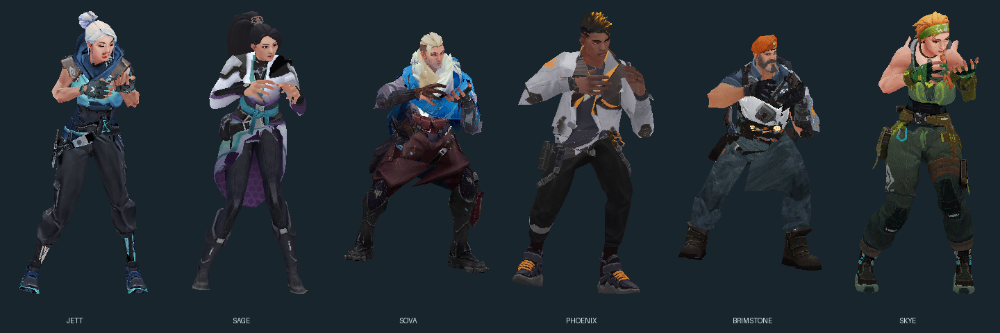
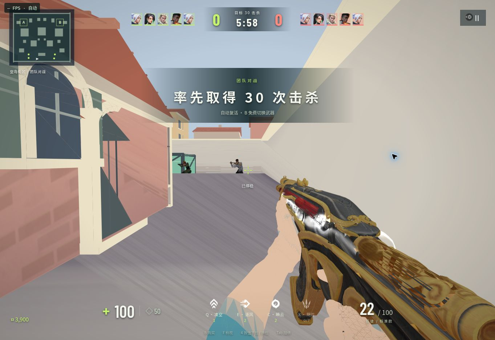

# Native character and rendering release — 2026-10-04

The active match now loads the six combat character models from the supplied
`val原版人物模型.zip`: Jett, Sage, Sova, Phoenix, Brimstone and Skye. Original
IDST v10 geometry, embedded palette textures, bones and animation streams are
preserved. The CT/T pairs are byte-identical; the client downloads each character
once. See `native-agent-sources.json` for every original file and checksum.

Procedural character bodies and first-person weapon placeholders have been
removed from the active gameplay path. All 19 weapon slots resolve imported
models. Saved unavailable procedural cosmetics migrate to an available native
model, and those choices are hidden in the collection. Invisible hit regions
remain simple geometry for gameplay collision. Bots display the correct native
rifle or pistol for the round. Raze's existing player abilities remain available;
she is excluded from the bot roster because this archive contains no Raze body.

The renderer no longer treats white emissive color as the diffuse surface color,
paints opaque white under additive mapped faces, or drops UVs at the near plane.
Native fullbright textures keep their intended material mode. Nine-way character
animation blends are supported, and the character coordinate transform preserves
a proper rotation and an upright body. Enemy outlines follow the actual skeleton.

This image is an offline rasterization of the actual posed game meshes and their
embedded textures. It checks body orientation and texture content, rather than
GPU lighting. The supplied combat streams drive aim, shooting, running and
grenade poses. First-person ability movement adapts the existing cast timing to
the imported hands; this is not a captured original agent ability animation.

Validation: 93 automated tests pass, including original checksums for all 12
character files, nine-way blend poses, upright head/body bounds, feet near the
ground, textured near clipping, additive rendering and native equipment
resolution. Match, imported equipment and collection integration checks pass;
movement checks cover six maps and 26 physical routes. Cloud-browser GPU/WebGL
is disabled, so its browser visual verification uses the software fallback.

## Published verification

The game release source is `bd8cb013ca6d2ac181c9eb54b37e5358910a5907`.
GitHub `main` was verified at this exact commit after an authenticated Git push.
GitHub Pages workflow run
[`37208947927`](https://github.com/btsunamib/minimal-valorant/actions/runs/37208947927)
completed successfully on 2026-10-04 at 14:21:59 UTC.

The deployed `index.html`, `main.js`, `agent-art.js`, `software-renderer.js` and
all six downloaded CT model assets were compared byte-for-byte with this source.
The public game loaded `main.js?v=20261004-native4` and started a team match.
The screenshot below shows actual character meshes and colored native weapon
textures in the deployed software fallback. No application runtime error was
observed; the cloud browser reports WebGL disabled. Browser performance in this
CPU fallback is limited and does not validate GPU or real-device performance.

